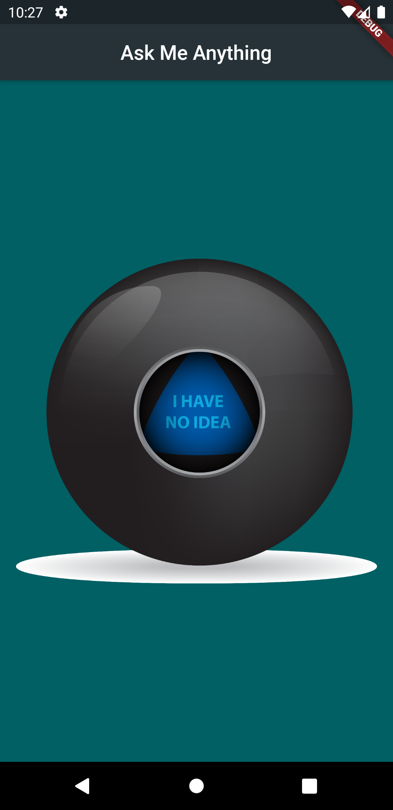

# Magic 8 Ball

A Flutter project for asking the magic 8 ball anything you want.

 

  

 

## Getting Started

A few resources to get you started:

- [Lab: Write your first Flutter app](https://flutter.dev/docs/get-started/codelab)
- [Cookbook: Useful Flutter samples](https://flutter.dev/docs/cookbook)
- [Section 8: Boss Level Challenge 1 - Magic 8 Ball](https://github.com/londonappbrewery/Flutter-Course-Resources#section-8-boss-level-challenge-1---magic-8-ball)
